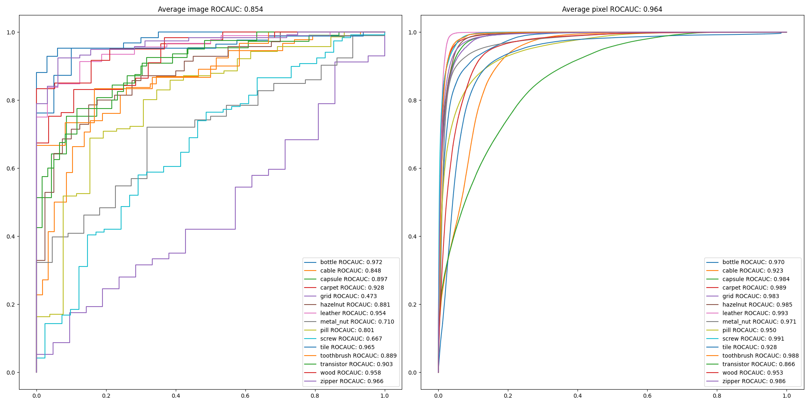

# Sub-Image Anomaly Detection with Deep Pyramid Correspondences (SPADE) in PyTorch

PyTorch implementation of [Sub-Image Anomaly Detection with Deep Pyramid Correspondences](https://arxiv.org/abs/2005.02357) (SPADE).  

**SPADE** presents an anomaly segmentation approach which does not require a training stage.  
It is fast, robust and achieves SOTA on `MVTec AD` dataset.  

* *We used K=5 nearest neighbors, which differs from the original paper K=50.*


## Prerequisites
* python 3.6+
* PyTorch 1.5+
* sklearn, matplotlib, wget

Install prerequisites with:  
```
pip install -r requirements.txt
```

## Usage

To test **SPADE** on `MVTec AD` dataset:
```
cd src
python main.py
```

After running the code above, you can see the ROCAUC results in `src/result/roc_curve.png`

## Results

Below is the implementation result of the test set ROCAUC on the `MVTec AD` dataset.  

### 1. Image-level anomaly detection accuracy (ROCAUC %)

| | Paper | Implementation |
| - | - | - |
| bottle | - | 97.2 |
| cable | - | 84.8 |
| capsule | - | 89.7 |
| carpet | - | 92.8 |
| grid | - | 47.3 |
| hazelnut | - | 88.1 |
| leather | - | 95.4 |
| metal_nut | - | 71.0 |
| pill | - | 80.1 |
| screw | - | 66.7 |
| tile | - | 96.5 |
| toothbrush | - | 88.9 |
| transistor | - | 90.3 |
| wood | - | 95.8 |
| zipper | - | 96.6 |
| Average | 85.5 | 85.4 |

### 2. Pixel-level anomaly detection accuracy (ROCAUC %)

| | Paper | Implementation |
| - | - | - |
| bottle | 98.4 | 97.0 |
| cable | 97.2 | 92.3 |
| capsule | 99.0 | 98.4 |
| carpet | 97.5 | 98.9 |
| grid | 93.7 | 98.3 |
| hazelnut | 99.1 | 98.5 |
| leather | 97.6 | 99.3 |
| metal_nut | 98.1 | 97.1 |
| pill | 96.5 | 95.0 |
| screw | 98.9 | 99.1 |
| tile | 87.4 | 92.8 |
| toothbrush | 97.9 | 98.8 |
| transistor | 94.1 | 86.6 |
| wood | 88.5 | 95.3 |
| zipper | 96.5 | 98.6 |
| Average | 96.5 | 96.4 |

### ROC Curve 


